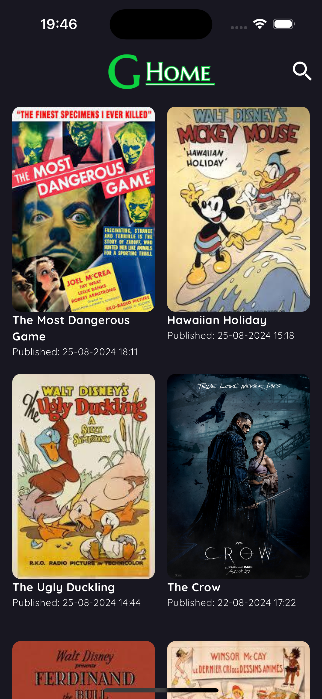
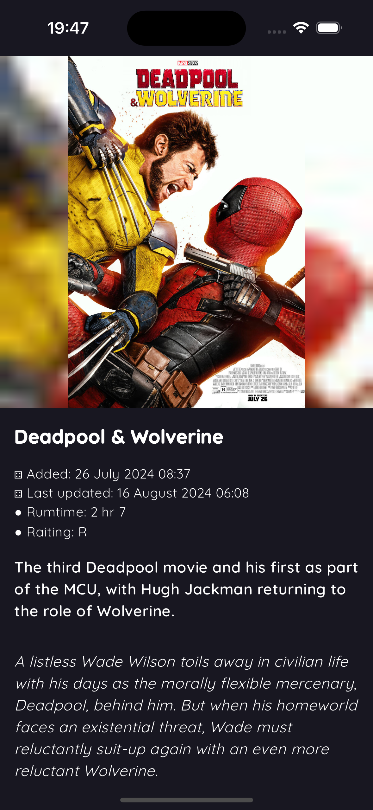
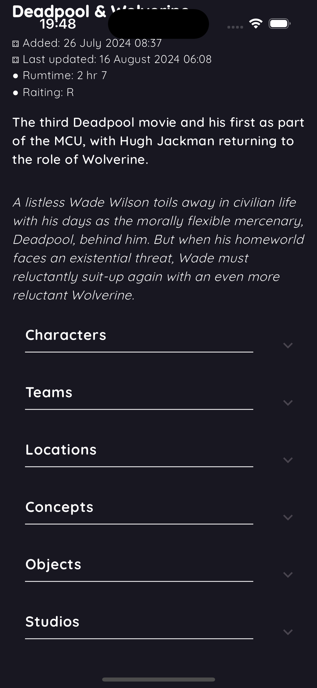

# Geek Home (GHome)

**Geek Home**, también conocida como **GHome**, es una aplicación diseñada para los amantes de los cómics y películas. Esta aplicación ha sido desarrollada como un caso de estudio utilizando la API de Comic Vive, específicamente trabajando con la categoría de "movies".

## Arquitectura

La aplicación es un ejemplo de cómo implementar una **arquitectura limpia** en Flutter utilizando **BLoC** (Business Logic Component). Esto permite mantener una separación clara entre las capas de presentación, dominio y datos, facilitando la escalabilidad y mantenibilidad del proyecto.

### Tecnologías Utilizadas

- **Flutter**: Framework para el desarrollo de aplicaciones móviles.
- **BLoC**: Patrón de arquitectura utilizado para la gestión del estado.
- **get_it**: Inyección de dependencias.
- **Comic Vive API**: Fuente de datos para la obtención de información sobre cómics y películas.
[Comic Vine](https://comicvine.gamespot.com/api/)

## Características Principales

- **Scroll Infinito**: Para la paginación se controla internamente, cada vez que el usaurio hace scroll se hace una nueva solicitud traendo mas datos que se suman a la lista ya dibujada en pantalla
- **Gestión de Estado con BLoC**: Utilización de BLoC para manejar la lógica de negocios y el estado de la aplicación.

## Instalación

Para ejecutar esta aplicación en tu entorno local, sigue estos pasos:

0. Instala Flutter [Documentación](https://docs.flutter.dev/)
1. Clona este repositorio.
2. Instala las dependencias usando `flutter pub get`.
3. Obten una `api_key` de Comic Vine par poder usar la API
4. Realiza una copia del archivo `/lib/api/api_config_example.dart` y renombra como `api_config.dart`,remplaza los valores de `api_key`.
5. Ejecuta la aplicación en tu dispositivo o emulador usando `flutter run`.

##### Capturas de pantalla del proyecto

## Contribuciones

Las contribuciones son bienvenidas. Si deseas contribuir, por favor abre un issue o un pull request.

